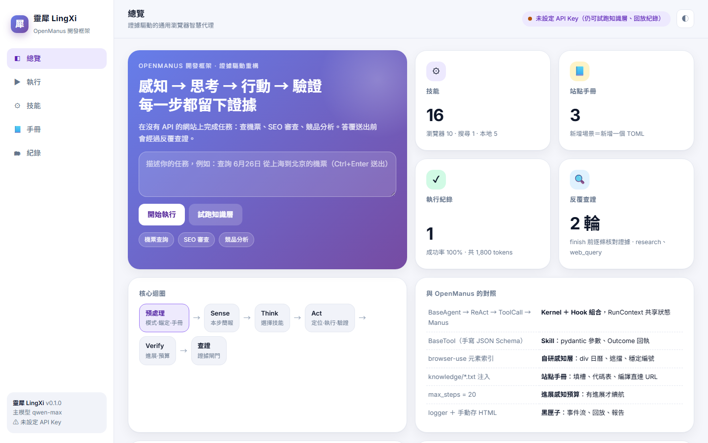
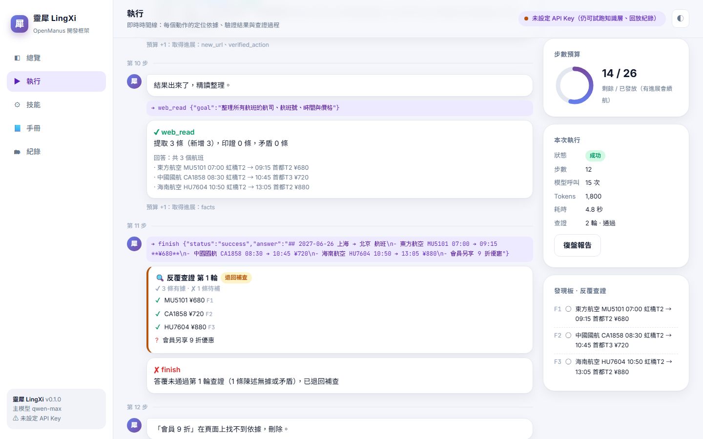
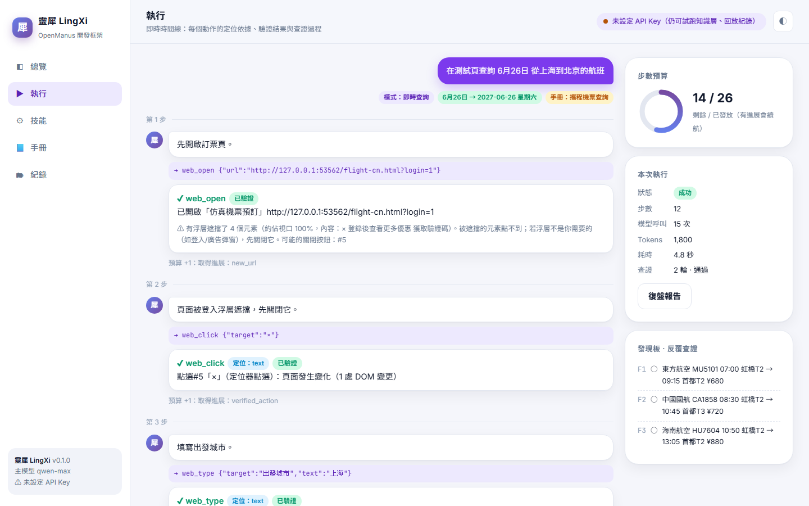
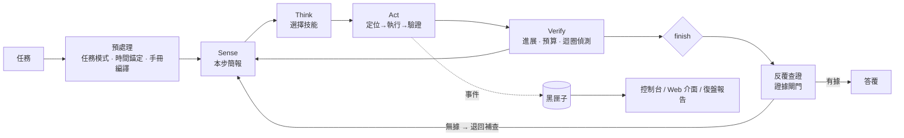
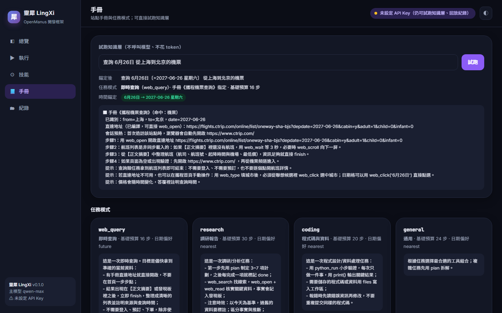

# 靈犀 LingXi

**OpenManus 開發框架的證據驅動重構** —— 感知 → 思考 → 行動 → 驗證 → 查證，每一步都留下證據。

靈犀延續 OpenManus「LLM ＋ 工具 ＋ 經驗」的開發框架思路，幫你在**沒有 API 的網站**上完成任務：查機票、做 SEO 審查、寫競品分析報告。
它脫胎於一次 OpenManus 開發實戰——把課程裡踩過的坑（日曆點不到、輸入不生效、年份算錯、深鏈被反爬、20 步不夠用、token 太貴、答覆沒有根據）
逐一變成框架層級的機制，而不是提示詞裡的補丁。



## 以 OpenManus 開發框架為主體

| OpenManus 的元件 | 靈犀的對應設計 | 為什麼要改 |
|---|---|---|
| `BaseAgent → ReActAgent → ToolCallAgent → Manus` 四級繼承 | `Kernel` ＋ 可插拔 `Hook`，元件只透過 `RunContext` 溝通 | 擴充不用改繼承鏈，行為可單獨測試 |
| `BaseTool`（手寫 JSON Schema） | `Skill`：pydantic 參數模型 ＋ `Outcome` 回執（是否驗證、定位依據、進展訊號） | 參數錯誤自動回饋；動作結果可被驗證 |
| browser-use 的 `[index]<tag>` 元素列表 | 自研 Playwright 感知層：div 日曆、月份上下文、遮擋偵測、穩定編號 | 課程裡日曆格子根本不在列表中 |
| `knowledge/*.txt` 注入系統提示 | 宣告式 TOML 站點手冊：匹配 → 填槽 → 代碼表 → 編譯直達 URL → 強制會話預熱 | 不依賴模型「記得」經驗 |
| `max_steps = 20` | 進展感知預算：有可驗證進展才續航，原地打轉扣減，最後一步強制收尾 | 20 步不夠、改大又浪費 |
| logger ＋ 手動存 HTML | 黑匣子事件流：控制台、Web 介面、離線復盤報告都是訂閱者 | 排障不再靠臨時加 print |
| `terminate` 直接結束 | **反覆查證**：finish 前逐條核對答覆中的事實，無據就退回補查 | 答覆要有根據 |

`python main.py`、`--prompt` 參數、`config/*.toml` 設定方式都保留了 OpenManus 的使用習慣。

## 核心機制

| 課程裡的故障 | 靈犀的機制 |
|---|---|
| 日曆是 `<div>` 格子，元素列表裡根本沒有 | **自研頁面快照**：cursor:pointer 啟發式辨識可點擊的 div，日期格自帶「2027年6月」月份上下文 |
| 視覺模型給的座標時準時不準、格式還亂 | **視覺 ＋ DOM 共識**：視覺座標經 `elementFromPoint` 反查 DOM 並比對文字，一致才採納 |
| 輸入了「上海」，出發城市還是「新加坡」 | **定位 → 執行 → 驗證**：回讀輸入值、列出聯想候選，沒有變化就標「未驗證」 |
| 模型把「6月26日」當成 2023 年 | **時間錨定**：任務進入模型前就寫成 `6月26日〔=2027-06-26 星期六〕` |
| 直接開啟深鏈被 whaleguard 攔截 | **站點手冊**：TOML 宣告預熱首頁，瀏覽器層強制「先首頁、後深鏈」 |
| 20 步硬上限 | **進展感知預算** |
| 2 天花掉 500 塊 token | **滾動記憶**：頁面只在本步簡報出現，舊觀察摺疊，事實存白板；工具集依任務模式裁剪 |
| 答覆裡混進模型自己「腦補」的數字 | **反覆查證**：發現板標示多源印證；finish 前逐條核對證據，最多退回 2 輪 |
| 介面是繁體、網站是簡體 | **一律繁體呈現、比對繁簡通吃**：網頁標題、元素標籤、正文摘要、搜尋結果與所有紀錄檔都轉成繁體（只轉字形、保留網站原本用詞）；繁體指令能定位簡體網頁；往簡體網站輸入時自動轉寫成簡體 |

### 反覆查證



1. **發現板多源印證**：`web_read` 每讀一個新來源，都會對照已有事實，標示 `✔ 多方印證` / `○ 單一來源` / `⚠ 有矛盾`；
2. **答覆證據閘門**：模型呼叫 `finish` 時，查證員把答覆拆成可查證的陳述（數字、價格、日期、名稱），逐條對照發現板（F 編號）與最近的頁面／工具輸出（E 編號）；
3. 有「無據／矛盾」且還有預算與輪次 → **退回**，把問題清單交給模型補查或修正，再查一輪；
4. 預算用盡的最後一步不退回，但會在答覆末尾**明確標註**未能查證的陳述。

查證員只看證據、不用自身知識，因此它檢查的是「答覆有沒有根據」。

## 一段真實的執行紀錄

在離線「迷你攜程」夾具頁上（由測試用的 ScriptedLLM 驅動，不需要 API Key）。這個網頁是**簡體**（模擬攜程），
但模型看到的、畫面上顯示的、寫進紀錄檔的全部是繁體；網站按鈕原本寫「搜索」，模型用「搜尋按鈕」描述也能定位：

```
◆ 靈犀啟動  任務：在測試頁查詢 6月26日 從上海到北京的航班
  ├ 任務模式：web_query（手冊《攜程機票查詢》指定）
  ├ 時間錨定：6月26日→2027-06-26 星期六
  ├ 命中手冊：攜程機票查詢  → https://flights.ctrip.com/online/list/oneway-sha-bjs?depdate=2027-06-26&cabin=y&adult=1&child=0&infant=0
── 第 1 步 · 剩餘預算 15 ──
  → web_open {"url": "http://127.0.0.1:<port>/flight-cn.html?login=1"}
  ✔ web_open [已驗證]：已開啟「仿真機票預訂」http://127.0.0.1:<port>/flight-cn.html?login=1
── 第 3 步 · 剩餘預算 15 ──
  → web_type {"target": "出發城市", "text": "上海"}
  ✔ web_type ⟨text⟩ [已驗證]：在 #1「出發城市」輸入「上海」
── 第 9 步 · 剩餘預算 15 ──
  → web_click {"target": "搜尋按鈕"}
  ✔ web_click ⟨text⟩ [已驗證]：點選#4「搜索」（定位器點選）：頁面跳轉到 …?from=SHA&to=BJS&date=2027-06-26
── 第 11 步 · 剩餘預算 15 ──
  🔍 反覆查證 第 1 輪：✔ 3 條有據 · ✘ 1 條待補 → 退回補查
── 第 12 步 · 剩餘預算 14 ──
  🔍 反覆查證 第 2 輪：✔ 3 條有據 · ✘ 0 條待補 → 放行
◆ 結束（success）· 12 步 · 15 次模型呼叫 · 1800 tokens
```



這次執行寫出的 `events.jsonl`、`result.md`、`report.html`，以及 Web 介面五個頁面實際顯示的文字，經程式掃描簡體字數皆為 0。

## 架構



```
lingxi/
├── kernel/      主迴圈 Kernel、RunContext、進展預算、滾動記憶、鉤子、任務模式、預處理、反覆查證
├── senses/      Playwright 會話、頁面快照腳本、元素定位證據鏈、視覺神諭
├── skills/      web_open/click/type/select/key/scroll/read/nav/wait/look、搜尋、Python、檔案、計畫、MCP、Daytona
├── knowledge/   時間錨定、站點手冊
├── journal/     黑匣子、控制台渲染、復盤報告
├── llm/         OpenAI 相容客戶端（DashScope / DeepSeek / Ollama / OpenAI …）
├── hanzi.py     繁簡處理：一律繁體呈現、比對繁簡通吃（對照表由 scripts/gen_hanzi.py 產生）
└── web/         FastAPI ＋ SSE 單頁介面
playbooks/       攜程機票 / SEO 審查 / 競品分析 手冊（新增場景＝新增一個 TOML）
tests/           離線「迷你攜程」夾具 ＋ 假模型端到端測試（54 項）
docs/            課程筆記整理 · 架構設計 · GitHub 差異化分析
```

## 快速開始

```bash
git clone https://github.com/JingLunHuang/OpenManus.git
```

```bash
cd OpenManus
```

```bash
python -m venv .venv
```

```bash
.venv\Scripts\python -m pip install -e ".[web,dev]"
```

```bash
.venv\Scripts\python -m playwright install chromium
```

設定金鑰（二選一）：複製 `.env.example` 為 `.env` 填入 `DASHSCOPE_API_KEY`，或設定同名環境變數。
要換模型／端點時，複製 `config/lingxi.example.toml` 為 `config/lingxi.toml` 修改。

```bash
.venv\Scripts\python -m lingxi doctor
```

執行任務（和 OpenManus 一樣也可以用 `python main.py`）：

```bash
.venv\Scripts\python -m lingxi run "查詢 6月26日 從上海到北京的機票"
```

啟動 Web 介面（http://127.0.0.1:8765）：

```bash
.venv\Scripts\python -m lingxi serve
```

### 不需要 API Key 也能體驗的部分

```bash
.venv\Scripts\python -m lingxi playbooks "查詢 6月26日 從上海到北京的機票"
```

試跑知識層：看到時間錨定、任務模式、命中的手冊和編譯好的直達 URL（Web 介面「手冊」頁也能試跑）。

```bash
.venv\Scripts\python -m pytest -q
```

54 項測試：在離線夾具頁上重現攜程的 div 日曆、聯想回滾、登入遮罩；繁體指令定位簡體網頁；
用 `ScriptedLLM` 跑完整任務與「退回 → 補查 → 放行」的查證循環，不產生任何模型費用。

## Web 介面

設計語彙參考 [joshhu/uitest](https://github.com/joshhu/uitest) 的 **AI-Native**（紫色漸層、非對稱圓角對話泡泡、思考中跳點）與 **Bento Box**（大圓角磚塊網格），
以開發框架為主體組織成五個頁面：

| 頁面 | 內容 |
|---|---|
| 總覽 | 任務輸入、技能／手冊／紀錄／查證統計、核心迴圈、與 OpenManus 的對照、模型與環境 |
| 執行 | 即時時間線：思考、技能呼叫、定位方式與驗證徽章、反覆查證卡片、步數預算環、發現板 |
| 技能 | 全部內建技能與參數說明（由框架自我描述 API 產生） |
| 手冊 | 試跑知識層、任務模式、站點手冊 |
| 紀錄 | 黑匣子中的每一次執行，點開即可回放 |

支援淺色／深色、手機寬度。



## 命令一覽

| 命令 | 作用 |
|---|---|
| `lingxi run "任務"` | 執行任務（`--headless` 無頭，`--debug` 每步存截圖與 HTML） |
| `lingxi serve` | Web 介面 |
| `lingxi playbooks ["任務"]` | 列出手冊／試跑知識層 |
| `lingxi replay [latest\|<執行目錄>] --open` | 把一次執行渲染成離線復盤報告 |
| `lingxi runs` | 最近的執行紀錄 |
| `lingxi doctor` | 檢查設定、金鑰、Chromium |

## 擴充

```python
from lingxi import LingXi
from lingxi.kernel.hooks import default_hooks

agent = LingXi(extra_skills=[MySkill()], hooks=[MyHook(), *default_hooks()])
result = await agent.run("任務")
```

- 技能：一個 pydantic 參數模型 ＋ 一個 `run()`，Schema 與校驗自動完成；
- 鉤子：`brief()` 往每步簡報裡加內容，`after_step()` 觀察每步結果；
- 手冊：`playbooks/` 下新增 TOML；MCP：設定 `[mcp.servers.<name>]`；雲沙箱：設定 `DAYTONA_API_KEY`；
- 查證：`[verify]` 可調整退回輪數與適用的任務模式。

範例見 [`examples/`](examples/)：`extend_lingxi.py`（自訂技能與鉤子）、`vision_grounding.py`（視覺定位）、`daytona_hello.py`（雲沙箱）。

## 文件

- [01 · 課程筆記整理](docs/01-課程筆記整理.md) —— OpenManus 的結構、執行流程、三個實戰案例與除錯過程、兩種增強策略、課堂問答
- [02 · 靈犀架構設計](docs/02-靈犀架構設計.md) —— 每個機制的設計動機、取捨與程式碼位置
- [03 · GitHub 差異化分析](docs/03-GitHub差異化分析.md) —— 與同源衍生專案、更廣生態的對比（含二次查證紀錄）


## License

MIT
