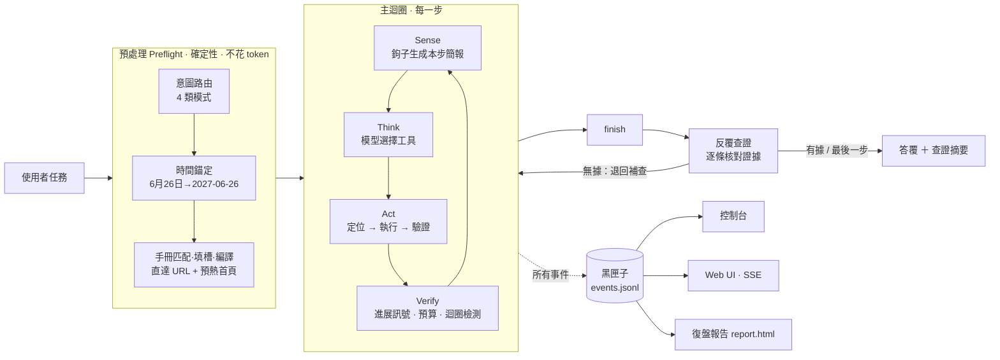

# 靈犀 LingXi 架構設計

> 一句話：**每一步都要有證據。** 感知要有依據（元素是怎麼找到的），行動要有回執（頁面到底變沒變），
> 預算要看進展（有進展才續航），答覆要經查證（每個數字都有來源），過程要留痕（黑匣子可回放）。

靈犀以 **OpenManus 開發框架**為主體：沿用它「LLM ＋ 工具 ＋ 經驗」的框架思路、分層（入口 → 智慧代理 → 工具 → 流程 → 基礎設施）
與使用習慣（`python main.py`、`--prompt`、TOML 設定），把課程裡遇到的每一個真實故障都改寫成框架層級的機制。
它不是 fork：核心、感知層、知識層、查證與可觀測性都是重新設計的，包名、目錄結構和執行模型也不同。
第 2 節逐項列出與 OpenManus 元件的對應關係。

---

## 1. 總覽



| 包 | 職責 | 關鍵檔案 |
|---|---|---|
| `lingxi.kernel` | 主迴圈、上下文、預算、記憶與白板、鉤子、任務模式、預處理、反覆查證 | `loop.py` `budget.py` `memory.py` `boards.py` `hooks.py` `preflight.py` `verify.py` |
| `lingxi.senses` | 感知：瀏覽器會話、頁面快照、元素定位、視覺神諭 | `dom_snapshot.js` `page.py` `grounding.py` `vision.py` `browser.py` |
| `lingxi.skills` | 技能：瀏覽器 10 個動作、搜尋、Python、檔案、計劃、提問、結束、MCP、Daytona | `web.py` `search.py` `local.py` `remote.py` |
| `lingxi.knowledge` | 知識：時間錨定、站點手冊 | `temporal.py` `playbook.py` |
| `lingxi.journal` | 可觀測性：事件記錄、控制台渲染、復盤報告 | `recorder.py` `console.py` `report.py` |
| `lingxi.llm` | 模型：OpenAI 相容客戶端、訊息模型、token 計量、KV 快取量測與上下文重放 | `client.py` `messages.py` `kvcache.py` |
| `lingxi.memory` | 自我學習記憶：LightMem 寫入管線、FluxMem 三層記憶圖與三階段演化、`recall` 技能 | `lightmem.py` `fluxmem.py` `graph.py` `system.py` |
| `lingxi.evolve` | 遞迴自我改進：版本化系統狀態、受保護評測、改進器與策略、自主歸屬帳本 | `state.py` `protected.py` `improver.py` `rsi.py` |
| `lingxi.retrieval` | 檢索層：LlamaIndex 混合檢索（自訂 MatrixVectorStore）、長網頁精讀聚焦、搜尋快取 | `index.py` `embed.py` `text.py` `focus.py` |
| `lingxi.web` | Web 介面：FastAPI + SSE + 單頁應用；框架自我描述、知識層試跑、學習面板 API | `server.py` `static/index.html` |
| `lingxi.hanzi` | 繁簡處理：網頁與紀錄一律轉繁體呈現；比對時逐字繁→簡（長度不變）＋ 兩岸用語統一 | `hanzi.py`（由 `scripts/gen_hanzi.py` 產生） |

---

## 2. 與 OpenManus 的結構性差異

| 維度 | OpenManus | 靈犀 |
|---|---|---|
| 智慧代理組織 | `BaseAgent → ReActAgent → ToolCallAgent → Manus` 四級繼承 | 一個 `Kernel` + 可插拔 `Hook`，元件只透過 `RunContext` 交流 |
| 瀏覽器 | 依賴 browser-use 0.1.x 的元素列表 | 直接用 Playwright + 自研快照腳本，不依賴 browser-use |
| 工具返回 | 一段文字（"Clicked element at index 36"） | `Outcome`：是否成功、**是否驗證**、定位依據、進展訊號、附件 |
| 工具參數 | 手寫 JSON Schema dict | pydantic 模型，Schema 自動生成，參數錯誤原樣反饋給模型 |
| 步數 | 固定 `max_steps` | 進展感知預算：有進展續航、打轉扣減、最後一步強制收尾 |
| 上下文 | 每步把完整頁面元素追加進歷史 | 頁面只在本步簡報出現；舊觀察摺疊；白板儲存關鍵事實 |
| 經驗 | 一段 txt 注入系統提示 | 宣告式 TOML 手冊：匹配、填槽、代碼表、編譯 URL、預熱 |
| 日期 | 提示詞寫"今天是 X" | 任務進入模型前解析成絕對日期寫回任務 |
| 排障 | 手動加 print、臨時儲存 HTML | 黑匣子事件流；控制台、Web UI、報告都是訂閱者 |
| 結束 | `terminate` 直接結束 | 反覆查證：finish 前逐條核對證據，無據退回補查 |
| 語言 | 漢化提示詞 | 繁體介面與提示；比對一律繁簡通吃（繁體指令可定位簡體網頁） |
| 程式碼量 | 約 1.5 萬行（含沙箱、A2A、Bedrock 等） | 約 5.7 千行（含 JS/HTML，不含繁簡對照資料），54 項測試 |

---

## 3. 核心機制詳解

### 3.1 感知：自研頁面快照（`senses/dom_snapshot.js` → `senses/page.py`）

快照腳本在頁面裡執行一次，返回結構化觀察：

- **候選元素**：標準可互動標籤與 ARIA 角色之外，額外用 `cursor:pointer` 找"最外層可點選元素"——
  React/Vue 渲染的 `<div>` 日曆格沒有 `onclick` 屬性，browser-use 看不見，這裡能看見。
- **語義類別**：日期格 / 輸入框 / 聯想選項 / 下拉框 / 勾選項 / 標籤頁 / 按鈕 / 連結。
- **日期格語義**：1~31 的數字 + 日曆容器；向上尋找 `2027年6月` 這樣的月份標題作為上下文；識別不可選日期。
- **輸入框標籤**：沒有 placeholder 時，從相鄰文字推斷（"出發城市"），並附帶當前值（`出發城市=新加坡`）。
- **遮擋檢測**：`elementFromPoint` 判斷元素是否被蓋住，按圖層統計，給出浮層提示與可能的關閉按鈕編號。
- **穩定編號**：`data-lx-id` 在元素存活期間不變，跨步驟引用 `#45` 不會漂移。
- **風險提示**：疑似反爬攔截（頁面幾乎為空）、人機驗證、iframe。

`PageSnapshot.render()` 把它渲染成按語義分組的簡報，短行正文會被壓縮合並，控制體積。

### 3.2 定位：證據鏈（`senses/grounding.py`）

`target` 可以是 `#45`、`出發城市`、`6月26日`。解析順序：

1. **編號直達**（`#45` / `編號45`；純數字先按日期理解）；
2. **語義打分**：標籤 / 值匹配 + 類別與意圖匹配（type 必須是輸入框）+ 遮擋、可用性、是否在視口；
   日期目標只和日期格比較"日 + 月"。**分數接近的多個候選不猜**，而是把候選編號返回給模型；
3. **視覺 + DOM 共識**：視覺模型給出座標 → `elementFromPoint` 反查 DOM 元素 → 校驗文字是否一致。
   一致則按 DOM 元素操作（`vision+dom`）；不一致才降級為座標點選（`vision`），並在結果裡說明。

每次定位的方法、分數、說明都記錄在 `Outcome.grounding` 裡，報告和 UI 中可見。

### 3.3 行動：定位 → 執行 → 驗證（`skills/web.py`）

| 動作 | 執行 | 驗證 |
|---|---|---|
| `web_click` | 定位器點選 → JS 點選 → 座標點選 | 動作前後探針對比：URL、DOM 變更數、焦點、標籤頁數 |
| `web_type` | 聚焦 → 清空 → 逐字輸入（觸發聯想） | **回讀輸入框的值**；列出新出現的聯想候選 |
| `web_select` | 原生 select 直接選；自定義下拉先展開再點選項 | 回讀選中項 |
| `web_open` | 過期日期順延 → 首次造訪站點先預熱首頁 → 開啟 | 是否被攔截 / 出現驗證 |

沒有觀察到變化時，結果被標註"未驗證"，模型會在觀察文字裡看到明確提醒；失敗或未驗證的動作自動截圖留證。

### 3.4 知識：時間錨定 + 站點手冊（`knowledge/`）

- **時間錨定**支援 `2026年1月30日`、`6月26日`、`六月二十六日`、`26號`、`明天`、`下週五` 等；
  `future` 偏好（訂票查詢）把已過去的日期順延到明年，`nearest` 偏好（回顧總結）取最近的年份；
  排除 `三亞5日遊`、`12月3000元` 這類誤報。
- **站點手冊**（`playbooks/*.toml`）宣告：觸發詞、站點名、槽位（正則 / 日期 / 代碼表）、URL 模板、預熱首頁、步驟、提示、日期參數。
  預處理階段完成匹配與編譯，模型拿到的是一條**已經可以直接開啟的地址**；
  預熱由瀏覽器層強制執行，日期參數由 `web_open` 自動糾正——**不依賴模型記得這些經驗**。
- 新增場景 = 新增一個 TOML 檔案；`lingxi playbooks "任務"` 可以不花 token 地試跑驗證。

### 3.5 預算：進展感知（`kernel/budget.py` + `kernel/hooks.py`）

- 每步消耗 1；本步出現強進展（新事實、計劃完成、產出檔案、搜尋結果）或
  紮實進展（新頁面、已驗證互動）時返還 1，總發放不超過 `基礎預算 × hard_cap_factor`；
- `LoopGuard`：同一頁面狀態下重複同一動作第 3 次扣 2 點並警告；同一工具連續失敗 3 次、連續 4 步無進展也會警告；
- 預算用盡的最後一步用 `tool_choice` 指定 `finish`（工具清單保持不變，推理端的前綴快取才不會失效），強制基於計劃板和發現板給出階段性結論；
- 最後一步之後迴圈偵測不再扣減預算——早期版本的「至少留 1 步」保底會在這時把預算從 0 補回 1，模型若仍不 finish 就會無限迴圈（已修正並有回歸測試）；
- 即使模型出錯中斷，核心也會把已確認的發現整理成答覆（`_salvage`）。

### 3.6 記憶：簡報 + 摺疊 + 白板（`kernel/memory.py` + `kernel/boards.py`）

- 本步簡報 = 任務（含錨定日期）+ 預算 + 計劃板 + 發現板 + 警告 + 頁面快照，**只在本次請求中出現**；
- 歷史中最近 6 輪保留完整觀察（有截斷上限），更早的摺疊為 `[已摺疊] ✔ 點選#35「26 ¥682」…`；
- **分段摺疊**（`[kv_cache] fold_block = 4`）：累積滿 4 輪才一次摺疊 4 輪，歷史在 4 步之內只追加、不改寫，推理端的 KV 前綴快取才能命中（細節見 [04](04-自我學習與加速.md) 第 5 節）；
- `tool_call` 與 `tool` 訊息始終成對，滿足 OpenAI 相容介面的格式要求；
- `web_read` 提取的事實進入發現板，每步都會重新渲染，歷史再怎麼摺疊也不會丟。

### 3.7 任務模式（`kernel/profiles.py` + `kernel/intent.py`）

| 模式 | 基礎預算 | 日期偏好 | 工具集 | 指引 |
|---|---|---|---|---|
| web_query 即時查詢 | 16 | future | 瀏覽器 + 搜尋 + Python + 計劃 | 有直達地址就直接開，拿到就 finish |
| research 調研報告 | 30 | nearest | 全部 | 先 plan，事實進發現板，注意時效，寫 Markdown |
| coding 程式碼與資料 | 20 | nearest | Python、檔案、計劃、少量瀏覽 | 小步驗證，讀錯誤資訊再改 |
| general 通用（兜底） | 24 | nearest | 全部 | — |

路由順序：手冊指定 > 關鍵詞規則 > （可選）LLM few-shot 判定 > general。模式只裁剪內建技能，自定義技能 / MCP / 沙箱始終可用。

### 3.8 黑匣子（`journal/`）

事件類型：`run.start · intent · temporal · playbook · step · think · outcome · findings · budget · guard · verify · human.ask · human.answer · error · run.finish`。

- 每次執行一個目錄：`runs/<時間>-<任務>/events.jsonl`、`artifacts/`（截圖、HTML）、`result.md`；
- 控制台輸出、Web UI（SSE）、`lingxi replay` 生成的離線報告都只是事件的不同渲染方式；
- `run.finish` 裡帶 token 用量（主模型 + 視覺模型）與耗時，方便評估成本。

### 3.9 反覆查證（`kernel/verify.py` + `kernel/boards.py` + `skills/web.py`）

兩層設計，都貫徹「證據驅動」：

**第一層：發現板多源印證。** 每條事實有編號（F1、F2…）與來源列表。`web_read` 讀新頁面時，會把已有發現一起交給提取器，
要求它回報本頁「印證了哪幾條」「與哪幾條矛盾」；同一事實（繁簡寫法不同也算）在另一個來源再次出現也會自動記為印證。
狀態分為 `✔ 多方印證`（兩個以上來源）、`○ 單一來源`、`⚠ 有矛盾`，每步都渲染進簡報，模型因此知道哪些結論還需要再找來源。

**第二層：答覆證據閘門。** 模型呼叫 `finish` 時，內核先請查證員：

1. 從答覆中列出可查證的事實陳述（數字、價格、日期、名稱、排名、引用），最多 12 條；
2. 逐條對照證據——發現板（F 編號，含印證狀態）＋ 最近 6 個工具輸出與目前頁面正文（E 編號）；
3. 判定 `supported / unsupported / conflict`。

| 情況 | 處理 |
|---|---|
| 全部有據 | 放行，答覆末尾附「查證摘要（反覆查證 N 輪）：✔ … 條陳述有證據支持（F1、E2…）」 |
| 有無據／矛盾，且未超過 `max_rounds`、預算還夠 | 退回：finish 變成失敗結果，問題清單交給模型；模型補查、修正或刪除後再次 finish，再查一輪 |
| 預算用盡的最後一步，或已達輪數上限 | 不退回，但在答覆末尾逐條標註「⚠ 未能查證 / 與證據矛盾」 |
| 沒有收集到任何證據、查證員輸出無法解析 | 不阻擋，但在摘要中說明「未經查證」 |

設計取捨：查證員**只看證據、不用自身知識**，所以它驗證的是「有沒有根據」而不是「對不對」——
前者可以被程式檢查，後者取決於證據本身，這正是第一層多源印證要處理的事。
查證適用於 `research` 與 `web_query` 模式（`[verify] profiles` 可調），每輪多一次模型呼叫。

### 3.10 一律繁體呈現、比對繁簡通吃（`lingxi/hanzi.py`）

攜程等網站是簡體字、大陸用語，但靈犀對外**一律呈現繁體**。處理分成兩個方向：

**呈現：簡→繁（`to_trad` / `to_trad_many` / `to_trad_deep`）**

| 出口 | 轉換內容 |
|---|---|
| 感知層 `PageSnapshot.from_js` | 網頁標題、每個元素的標籤與值、正文摘要、浮層提示（一次批次轉換，上百個標籤約 1 毫秒） |
| 技能輸出 | 搜尋結果的標題與摘要、`web_read` 讀到的正文與提取的事實、`web_look` 的看圖回答、輸入框回讀值 |
| 黑匣子 `Journal.emit` / `write_text` | 所有事件（思考、動作參數、摘要、答覆、查證）與 `result.md`；網址等識別欄位保留原樣 |
| 工作區檔案 | 代理用 `files` 寫出的 `.md / .txt / .html / .csv / .json`（程式碼檔不轉；`[agent] traditional_output` 可關閉） |

設計取捨：

- 使用 OpenCC 的 **s2tw**（依詞判斷一簡對多繁的字形，例如「頭髮」與「出發」），**不使用 s2twp 的詞彙改寫**——
  網頁內容是證據，只換字形、保留網站原本的用詞（網站寫「搜索」就顯示「搜索」），也避免把繁體原文的「支持」改成「支援」；
- 「是否需要轉換」以 **Big5（cp950）** 為判準：Big5 收錄的字（台、游、里…台灣本來就這樣寫）不算簡體，因此繁體文字原樣通過，不會被誤改成「臺北」；
- 操作仍然透過 `data-lx-id` 編號定位，轉換不影響點擊；
- 例外：`--debug` 模式保存的原始 HTML 與截圖是網頁原貌的證據，不做轉換。

**比對：繁→簡（只在記憶體裡用，不會顯示）**

- `fold(text)`：逐字繁→簡（4118 個單字對照），**長度不變**——時間錨定與手冊填槽在摺疊後的文字上比對，再用同樣的位置切回原文，
  因此不論使用者用繁體或簡體寫「從廣州」，都得到同一個城市代碼，顯示時仍保留使用者原文；
- `unify(text)`：`fold` 後再統一兩岸用語（475 組，如「搜尋／搜索」「資訊／信息」「登入／登錄」），用於元素定位、意圖關鍵詞、手冊觸發詞的比較；
- `detect_script(text)`：判斷網頁是簡體還是繁體。往簡體網站 `web_type` 時，先把繁體輸入轉寫成簡體與大陸用語，網站自己的聯想搜尋才對得上；
- 頁面快照腳本需要的比對詞（關閉按鈕、人機驗證字樣）由 Python 以 `fold()` 展開兩種寫法後注入，原始碼裡只寫繁體。

比對用對照表由 `scripts/gen_hanzi.py` 從 OpenCC 產生（這張表本身必然包含簡體字）；測試用的簡體網站 `flight-cn.html` 也是執行時由 `unify()` 產生，倉庫裡不存放簡體網頁。

### 3.11 Web 介面（`web/`）

設計語彙參考 joshhu/uitest 的 AI-Native（紫色漸層、非對稱圓角對話泡泡、思考中跳點）與 Bento Box（大圓角磚塊網格），
以開發框架為主體組織成六頁：總覽（統計、核心迴圈、OpenManus 對照、模型與環境）、執行（即時時間線＋預算環＋發現板）、
技能（由 `/api/framework` 自我描述產生）、手冊（`/api/preflight` 試跑知識層，不花 token）、紀錄（回放任一次執行）、
學習（`/api/learning`：三層記憶圖、試召回、程序技能與 PEMS 曲線、RSI 版本時間線與回滾、每輪候選、自主等級、KV 前綴重用率、加速基準）。
介面只是黑匣子的訂閱者；淺色／深色與手機寬度都已支援。

### 3.12 自我學習與加速（`memory/` `evolve/` `retrieval/` `llm/kvcache.py`）

- **記憶**：`MemoryHook` 在開始時用 FluxMem Stage I 召回三層記憶放進系統提示、換站點時補入站點知識、每步做 Stage II 回饋精煉、
  結束時用 LightMem 管線寫入（執行中零模型呼叫）；每 5 次執行自動睡眠整理（LightMem 離線更新 ＋ FluxMem Stage III 鞏固）。
- **RSI**：`lingxi evolve round` 從經驗提出候選（KV 參數、檢索參數、PEMS 已收斂的技能→手冊），通過受保護評測才成為新版本；
  `LingXi` 每次執行載入目前版本，黑匣子記下版本號。
- **加速**：KV 快取友善的上下文佈局與量測；LlamaIndex 混合檢索用在記憶召回、長網頁精讀、搜尋快取。

完整設計、與論文的對應、實測數字與限制見 [04 · 自我學習與加速](04-自我學習與加速.md)。

---

## 4. 擴充指南

**新增技能**

```python
from pydantic import BaseModel, Field
from lingxi.skills.base import Outcome, Skill

class WeatherParams(BaseModel):
    city: str = Field(description="城市名")

class Weather(Skill):
    name = "weather"
    description = "查詢城市天氣（呼叫某個天氣 API）"
    Params = WeatherParams

    async def run(self, ctx, p: WeatherParams) -> Outcome:
        ...
        return Outcome(ok=True, summary=f"{p.city} 晴 25℃", verified=True, progress=["facts"])

LingXi(extra_skills=[Weather()])
```

**新增鉤子**：繼承 `Hook`，實現 `on_start(ctx)`（往系統提示加內容，整次執行不變）、`brief(ctx)`（往每步簡報裡加內容）、
`after_step(...)`（觀察每步結果）或 `on_finish(ctx, status, answer)`（收尾，例如寫入記憶）。
**新增手冊**：在 `playbooks/` 放一個 TOML。**接入 MCP**：在設定裡加 `[mcp.servers.<name>]`。
完整示例見 `examples/extend_lingxi.py`。

---

## 5. 測試策略

| 層 | 測試 | 是否需要瀏覽器 / 模型 |
|---|---|---|
| 知識層 | 日期錨定的各種寫法與誤報、手冊編譯與缺槽 | 否 / 否 |
| 核心部件 | 路由、預算、記憶摺疊、視覺輸出解析、定位打分與歧義 | 否 / 否 |
| 感知與行動 | 本地夾具頁復刻攜程三大難點：div 日曆、聯想回滾、登入遮罩 | 是 / 否 |
| 端到端 | `ScriptedLLM` 按劇本驅動完整任務；迴圈檢測與強制收尾；Web 介面 | 是 / 否 |
| 反覆查證 | 多源印證與矛盾標記；查證員輸出解析；「退回 → 補查 → 放行」完整循環；輪數上限與不適用模式 | 否 / 否 |
| 繁簡處理 | 簡體網站一律繁體呈現（標題、標籤、摘要）；繁體指令定位簡體網頁；往簡體網站輸入自動轉寫；簡體任務的時間錨定與手冊填槽 | 是 / 否 |
| 檢索與 KV 快取 | LlamaIndex 與純 Python 後端排序一致；繁簡通吃；長網頁聚焦（含真實瀏覽器端到端）；搜尋快取數字不同不誤命中；分段摺疊只追加不改寫；顯式快取標記；各家用量欄位；最後一步不 finish 也會結束 | 部分 / 否 |
| 自我學習記憶 | 動作簽名抽象；站點經驗篩選；寫入→召回；睡眠整理的合併、以新換舊、不同日期不合併；技能蒸餾與 PEMS；Stage II 剪枝與擴充；並行寫入不互相覆蓋；跨執行學習；記憶投毒防護 | 否 / 否 |
| RSI | 改進器看不到評測集；查詢預算；上下文評測偏好分段摺疊；參數白名單與範圍；策略反向減半；接受→繼承→回滾；全部拒絕時系統不變；手冊匯出；門面套用版本並按排程睡眠整理 | 否 / 否 |

`tests/fixtures/flight.html` 是一個離線的"迷你攜程"，所有測試都不呼叫任何付費模型。

---

## 6. 已知限制與路線圖

- 跨域 iframe 內的元素暫不進入快照（會在簡報中提示 iframe 數量）；
- 視覺神諭依賴 DashScope 的 gui-plus / qwen-vl，其他廠商的座標格式可能需要調整 `coord_space`；
- 反覆查證依賴查證員模型的判斷力；它檢查的是「有沒有根據」，證據本身是否可靠仍需多源印證來支撐；
- 「從黑匣子自動生成手冊草稿」已由 FluxMem 技能蒸餾 ＋ RSI 手冊匯出實現（0.2）；
- 路線圖：用真實模型對同一批任務做「有記憶 / 無記憶」的成功率與 token 對照實驗；受保護評測加入真實模型的端到端套件（預算對等）；
  多標籤並行檢索；查證時對單一來源的關鍵數字自動發起第二來源檢索。
